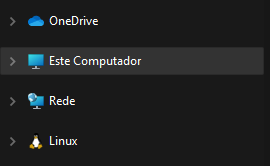
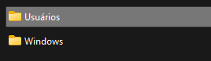
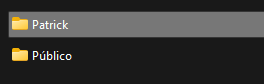

## Configuração inicial / Initial setting 

* Abra o explorador de arquivos e entre em Este computador (ou no nome que estiver): 
 

     
 

* Vá em dico local C / C:

     
 

* Vá para Usuários e entre no seu usuário

     
 

* Baixe em seu PC o arquivo <code>.bashrc</code> e em seguida copie ele para dentro da pasta do seu usuário

     
 

* Agora você está pronto para usar o facilitador de vidas 

 

## Pré-requisito 

* O único pré-requisito é usar um bash do linux, pode ser até mesmo o <strong>Git Bash</strong>
 

## Antes de usar

* Certifique-se que seu terminal é algum bash (recomendo o <strong>Git Bash</strong>)

* Caso goste de usar o teminal direto do <strong>VsCode</strong>, recomendo que deixe o terminal Bash como padrão 

 

## Comando

Enfim o comando. Teste no seu Bash o comando <code>ggcvr</code> de <strong>gg create vite react</strong>

O gg não significa nada, é só um padrão, se você abrir o código do <code>.bashrc</code> você vai encontrar esse padrão nos outros códigos também

Vale comentar que não precisa se preocupar com os outros códigos, pois o comando principal já chama os outros como se fosse as variáveis do JavaScript

 

## <mark>ATENÇÃO<mark>

Neste código utilizei o <a href="https://vitejs.dev"><strong>ViteJs</strong></a> que instala só o básico para rodar uma aplicação React, 
demora aproximadamente 10 segundos para preparar o ambiente se comparado ao <code>create-react-app</code> que estamos acostumados a usar, então não estranhe o jeito que ele
irá criar os arquivos e as pastas, é bom lembrar que ele não instala o <code>node modules</code>, é necessário entrar no diretório da aplicação e rodar um yarn ou npm init para instalar o <code>node modules</code> para o vite

 
  
 
 ## Atualizações
 

Iriei acrescentar mais coisas a esse facilitador como esse yarn ou npm automático no seu src para criar o <code>node modules</code> mas por enquanto fica apenas nisso

 
 ## Contribuição
 
 
Fique a vontade para contrinuir nesse facilitador e você mesmo pode fazer o seu. Logo mais teremos novidades.

